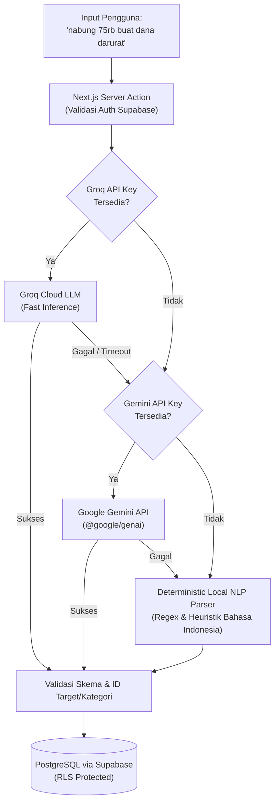

<p align="center">
  
</p>

<p align="center">
  <strong>Platform Pencatatan & Kolaborasi Tabungan Berbasis AI dengan Multi-Workspace Tenancy</strong>
</p>

<p align="center">
  
  
  
  
  
  
  
</p>

---

## 📌 Ringkasan Eksekutif

**Nabungin** adalah aplikasi web manajemen tabungan modern yang dirancang untuk memecahkan friksi pencatatan finansial personal dan tabungan bersama (*collaborative saving*). Sistem ini mengintegrasikan **Natural Language Processing (NLP)** untuk input mutasi kas cepat, asisten konsultasi finansial berbasis data riil pengguna, serta arsitektur multi-tenant dengan proteksi *Row Level Security (RLS)* di level basis data.

Dibangun dengan prinsip **Free-First & High-Resilience Architecture**, aplikasi ini memiliki mekanisme *graceful degradation* 3 lapis pada fitur AI sehingga fungsi inti transaksi tetap berjalan 100% tanpa gangguan sekalipun penyedia AI pihak ketiga mengalami kendala jaringan atau kuota habis.

---

## 🎯 Masalah Finansial vs Solusi Rekayasa

| Tantangan Konvensional | Solusi Rekayasa di Nabungin |
| :--- | :--- |
| **Uang bertumpuk di satu rekening**, membuat progres target tabungan spesifik kabur dan memicu pengeluaran impulsif. | **Goal-Based Segregation**: Pemisahan saldo ke dalam target nominal dengan visualisasi progres dan kalkulasi amortisasi harian/mingguan. |
| **Pencatatan tabungan bersama via spreadsheet / chat** rawan selisih, tidak transparan, dan rentan human error. | **Collaborative Workspaces**: Multi-tenant workspace dengan sistem token undangan berbatas waktu, role aman, dan *activity feed* mutasi. |
| **Pencatatan transaksi manual yang merepotkan** (harus memilih dropdown akun, kategori, nominal di formulir panjang). | **Smart Quick-Add (NLP)**: Cukup tulis *"nabung 50rb buat laptop"* atau *"tarik 100k"*, AI otomatis mengonversi teks bebas menjadi data terstruktur. |
| **Ketergantungan rapuh pada API AI eksternal**, aplikasi rawan rusak (*crash*) jika API pihak ketiga down atau rate-limited. | **3-Tier AI Fallback Engine**: Otomatis berpindah dari Groq LLM &rarr; Google Gemini &rarr; Local Regex NLP Parser tanpa kegagalan di sisi pengguna. |

---

## ✨ Fitur Unggulan

### 1. 🤖 AI Financial Engineering
* **Smart Quick-Add (Natural Language Parser)**  
  Mengubah teks percakapan bebas menjadi payload transaksi terstruktur (`amount`, `type`, `goalId`, `categoryId`, `description`) dengan validasi integritas ID sebelum disimpan.
* **Context-Aware Financial Advisor ("Nabu")**  
  Asisten keuangan interaktif yang menerima injeksi metrik pengguna nyata (total saldo aktif, rasio setoran vs penarikan 30 hari, daftar target terdekat, dan laju setoran harian yang dibutuhkan). Saran yang diberikan terukur matematis dan spesifik konteks pengguna.
* **Smart Target Prioritization & Math**  
  Menghitung secara deterministik sisa hari menuju deadline dan estimasi nominal setoran yang diperlukan per hari, per minggu, atau per bulan untuk mencapai target tepat waktu.

### 2. 👥 Kolaborasi & Multi-Workspace Tenancy
* **Multi-Workspace System**: Satu akun pengguna dapat mengelola ruang tabungan personal mandiri dan beberapa ruang kolaborasi grup (pasangan, keluarga, patungan trip).
* **Invite Token Generator**: Pembuatan kode undangan unik untuk bergabung ke workspace grup dengan mekanisme proteksi role (Owner vs Member).
* **Audit Trail / Activity Feed**: Riwayat setiap transaksi dan mutasi anggota tercatat transparan untuk menjaga akuntabilitas grup.

### 3. 🎯 Manajemen Goals & Kategori
* **Visual Progress Tracker**: Progres nominal, sisa kekurangan, dan estimasi waktu target.
* **Kategori Transaksi Dinamis**: Klasifikasi setoran dan penarikan untuk analisis arus kas yang rapi.
* **Export Laporan Transaksi**: Ekspor riwayat mutasi ke format CSV/Spreadsheet untuk kebutuhan pencatatan pembukuan eksternal.

### 4. 📱 Progressive Web App (PWA) & Responsive UX
* Dilengkapi `manifest.json`, icon maskable, tema visual konsisten, dan navigasi mobile-first yang responsif di berbagai resolusi layar.

---

## 🧩 Arsitektur Sistem & Alur AI Resilient

Salah satu keunggulan teknis utama dari Nabungin adalah sistem ketahanan (*fault-tolerance*) pemrosesan bahasa alami. Aplikasi tidak pernah menggantungkan ketersediaan fungsi inti pada satu penyedia eksternal saja:



### Keamanan & Desain Data:
* **Zero Client Leakage**: Seluruh komunikasi LLM dan integrasi API dijalankan di server via Next.js Server Actions. Kunci API tidak pernah terekspos ke bundle browser klien.
* **Row Level Security (RLS)**: Akses data pada tabel `workspaces`, `goals`, `transactions`, dan `categories` dibatasi secara ketat di level PostgreSQL berdasarkan `auth.uid()` dan keanggotaan workspace.
* **Deterministic Fallback**: Local NLP Parser menangani variasi penulisan nominal lokal Indonesia (misal: *50k*, *100rb*, *1.5jt*, *juta*) bahkan saat perangkat offline atau tanpa API key.

---

## 📂 Pemetaan Kode Inti (*Code Map*)

| Modul / Berkas | Tanggung Jawab & Implementasi Teknis |
| :--- | :--- |
| `src/actions/ai-quick-add.ts` | Orkestrasi alur fallback 3-tier dan validasi payload transaksi |
| `src/lib/ai/groq.ts` | Klien inferensi LLM Groq dengan structured JSON schema output |
| `src/lib/ai/gemini.ts` | Klien integrasi Google Gemini via SDK resmi `@google/genai` |
| `src/lib/ai/fallback-parser.ts` | Parser NLP lokal deterministik untuk parsing teks transaksi Indonesia |
| `src/actions/ai-advisor.ts` | AI Advisor Nabu dengan *context injection* data finansial riil pengguna |
| `src/lib/ai/advisor-helpers.ts` | Perhitungan matematis deadline, kebutuhan setoran berkala, dan skor kesehatan tabungan |
| `src/actions/workspaces.ts` | Manajemen tenancy workspace (CRUD, switch workspace, cascade delete) |
| `src/actions/collaboration.ts` | Sistem pembuatan & validasi token invite member grup |
| `src/actions/export.ts` | Generator data mutasi transaksi ke format CSV terstruktur |

---

## 🛠️ Tech Stack

### Frontend & Core Framework
* **Next.js 16.3 (App Router)** – Server Components, Server Actions, Dynamic Layouts.
* **React 19.2** – Modern reactive architecture & state handling.
* **TypeScript 5.x** – Strict type checking pada model basis data, action payload, dan utilitas.
* **Tailwind CSS v4** – Utility-first CSS modern dengan performa kompilasi optimal.
* **Lucide React** – Koleksi icon antarmuka yang konsisten dan ringan.

### Backend & Database
* **Supabase** – Managed PostgreSQL, User Authentication, Session Management SSR via `@supabase/ssr`.
* **PostgreSQL Row Level Security (RLS)** – Isolasi data multi-user & multi-workspace langsung di layer database.

### AI & Natural Language Processing
* **Groq SDK** – High-speed LLM inference.
* **Google Gemini (`@google/genai`)** – Secondary LLM fallback provider.
* **Custom Regex NLP Engine** – Zero-dependency local parser untuk bahasa percakapan sehari-hari.

---

## 🚀 Panduan Menjalankan Secara Lokal

### Prasyarat
* Node.js versi 20.x atau lebih baru
* Akun Supabase (gratis)

### 1. Kloning Repositori
```bash
git clone https://github.com/karangsawo123/nabungin.git
cd nabungin
```

### 2. Instalasi Dependensi
```bash
npm install
```

### 3. Konfigurasi Environment Variables
Salin template berkas konfigurasi `.env.example`:
```bash
cp .env.example .env.local
```
Sesuaikan variabel di dalam `.env.local`:
```env
# Konfigurasi Supabase (Wajib)
NEXT_PUBLIC_SUPABASE_URL=https://your-project-id.supabase.co
NEXT_PUBLIC_SUPABASE_ANON_KEY=your-supabase-anon-key
SUPABASE_SERVICE_ROLE_KEY=your-supabase-service-role-key

# Konfigurasi Kunci AI (Opsional)
# Jika dikosongkan, fitur Smart Quick-Add otomatis menggunakan Local NLP Parser bawaan
GROQ_API_KEY=your-groq-api-key
GEMINI_API_KEY=your-gemini-api-key
```

### 4. Setup Skema Basis Data
Jalankan file migrasi SQL di folder `supabase/migrations/` secara berurutan melalui Supabase SQL Editor atau Supabase CLI. Spesifikasi skema lengkap dan dokumentasi arsitektur dapat ditinjau di [`BLUEPRINT.md`](./BLUEPRINT.md).

### 5. Menjalankan Server Pengembangan
```bash
npm run dev
```
Aplikasi dapat diakses melalui browser di `http://localhost:3000`.

### Perintah Pengecekan Kualitas Kode
```bash
npm run lint        # Verifikasi standar kode via ESLint 9
npm run typecheck   # Validasi konsistensi tipe TypeScript
npm run build       # Simulasi kompilasi bundle produksi Next.js
```

---

## 📐 Arsitektur Folder Proyek

```text
nabungin/
├── public/                 # Asset statis, logo vektor, dan ikon PWA
├── src/
│   ├── actions/            # Next.js Server Actions (Auth, AI, Transaksi, Workspace)
│   ├── app/                # Next.js App Router (Routing, Layout, Page Views)
│   │   ├── (auth)/         # Halaman autentikasi (login, register)
│   │   ├── (dashboard)/    # Area terproteksi (goals, categories, groups, transactions)
│   │   ├── invite/         # Handler link undangan workspace
│   │   └── page.tsx        # Landing page
│   ├── components/         # Komponen UI modular (Activity, AI, Analytics, Goals, dll.)
│   ├── lib/                # Library helper, koneksi Supabase, dan parser AI
│   │   ├── ai/             # Groq client, Gemini client, & Fallback parser
│   │   └── supabase/       # Client & server helper (@supabase/ssr)
│   ├── middleware.ts       # Proteksi route & pengecekan sesi autentikasi
│   └── types/              # Definisi interface & type contracts TypeScript
├── supabase/               # SQL migrations, skema DDL, dan kebijakan RLS
├── BLUEPRINT.md            # Dokumentasi arsitektur teknis menyeluruh (800+ baris)
└── README.md               # Dokumentasi proyek
```

---

## 💡 Rekayasa & Pembelajaran Utama (*Key Takeaways*)

1. **Defensive AI Engineering**: Menggabungkan kecerdasan LLM dengan validasi skema ketat dan *deterministic local fallback* memastikan aplikasi tidak pernah kehilangan fungsionalitas intinya.
2. **Server-First Security Posture**: Menerapkan Server Actions dan Supabase SSR untuk memastikan kunci sensitif tetap berada di server dan data hanya dapat diakses oleh pemiliknya lewat RLS.
3. **Optimasi Biaya Operasional (Rp0)**: Arsitektur aplikasi dirancang efisien memanfaatkan resource cloud gratisan (Vercel, Supabase, Groq/Gemini free tiers) tanpa mengorbankan keamanan maupun performa.

---

## 👨‍💻 Pengembang

**M. Dicky Andrean**  
*Full-Stack Web Developer*  
* GitHub: [@karangsawo123](https://github.com/karangsawo123)  
* Email: karangsawo123@gmail.com

---

<p align="center">
  <sub>Dibuat dengan dedikasi untuk kebersihan kode, keandalan sistem, dan pengalaman pengguna yang bermakna.</sub>
</p>
